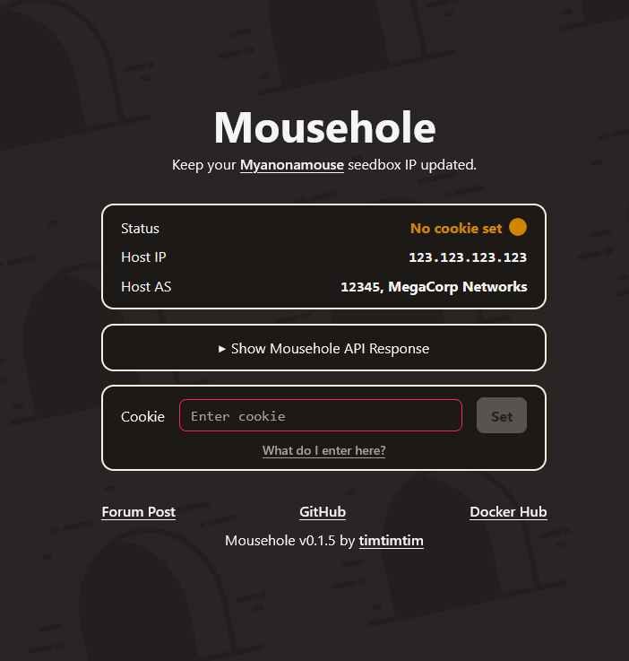

# Mousehole, a Seedbox IP Updater for MAM

A background service to update a seedbox IP for MAM and an HTTP server to manage
it.



This can be helpful if you are using a host/VPN/seedbox to seed and its IP
address is not stable.

Features:

- Background service that regularly updates MAM with the IP address of the host.

  Before an update, Mousehole checks that it actually needs to update by
  comparing the host's current IP address and AS against the last MAM response.

- Frontend website to manage the service, allowing:
  - Setting your MAM cookie
  - Displaying status information
  - Manual triggering of checks

- API server with management endpoints.

  See [API.md](docs/API.md) for details.

## Getting Started

To use Mousehole, you need to:

1. [Run the service](#step-1-run-the-service)
2. [Set your MAM cookie via the web interface](#step-2-set-your-mam-cookie)

### Step 1: Run the service

#### Docker Compose (recommended)

```yaml
services:
  gluetun:
    image: qmcgaw/gluetun:latest
    cap_add:
      - NET_ADMIN
    devices:
      - /dev/net/tun:/dev/net/tun
    ports:
      - "5010:5010" # Mousehole port
      - "8080:8080" # qBittorrent Web UI port
      - "6881:6881/tcp" # qBittorrent TCP torrent port
      - "6881:6881/udp" # qBittorrent UDP torrent port
    environment:
      VPN_SERVICE_PROVIDER: "your-vpn-provider"
      FIREWALL_VPN_INPUT_PORTS: "6881" # qBittorrent torrent
      # more is needed here -- see Gluetun documentation
      # https://github.com/qdm12/gluetun-wiki
      # https://github.com/qdm12/gluetun-wiki/tree/main/setup/providers
    restart: unless-stopped

  qbittorrent:
    image: lscr.io/linuxserver/qbittorrent:latest
    network_mode: "service:gluetun"
    environment:
      TZ: Etc/UTC # Set to your timezone for localization
      WEBUI_PORT: 8080
      TORRENTING_PORT: 6881
    restart: unless-stopped

  mousehole:
    image: tmmrtn/mousehole:latest
    network_mode: "service:gluetun"
    environment:
      TZ: Etc/UTC # Set to your timezone for localization
    volumes:
      # persist cookie data across container restarts
      - "mousehole:/srv/mousehole"
    restart: unless-stopped

volumes:
  mousehole:
```

Starter Docker Compose examples:

- ⭐
  [Gluetun + qBittorrent + Mousehole](docs/docker-compose-examples/gluetun-qb.md)
- [Wireguard + qBittorrent + Mousehole](docs/docker-compose-examples/wireguard-qb.md)
- [hotio/qBittorrent + Mousehole](docs/docker-compose-examples/hotio-qb.md)
- [binhex/arch-qbittorrentvpn + Mousehole](docs/docker-compose-examples/binhex-qb.md)
- [Non-VPN Example](docs/docker-compose-examples/non-vpn.md)

Any VPN setup can be adapted to include Mousehole as a sidecar. See
[Using Mousehole as a Sidecar with Docker Compose](docs/sidecars.md) for
details.

#### Unraid

See the [Unraid Installation Guide](contrib/unraid/README.md) for
instructions.

#### Local

Run the server with:

```bash
bun run start
```

### Step 2: Set Your MAM Cookie

Navigate to the Mousehole web UI at `http://<host>:5010` (likely
<http://localhost:5010> if running locally) and paste in your MAM cookie.

See [Getting Your Cookie Value](docs/getting-your-cookie.md) for a full
walkthrough of how to obtain the cookie from MAM.

## Handling Errors

Even with Mousehole up and running, things can still go wrong that Mousehole
cannot fix automatically. Check out the [error documentation](docs/errors.md)
for help with troubleshooting.

## Docker Tags

Mousehole publishes several image tags to
[Docker Hub](https://hub.docker.com/r/tmmrtn/mousehole):

- SemVer versions (`0`, `0.1`, `0.1.11`, etc)
- `latest`, the latest released version
- `edge`, the tip of `master` branch
- Pull requests targeting `master` for testing, tagged as `pr-<number>`

Choose `latest` if you do not know which to pick.

## Environment Variables

- `MOUSEHOLE_PORT`: _(Default `5010`)_ The port on which the HTTP server will
  listen.
- `MOUSEHOLE_STATE_DIR_PATH`: _(Default `/srv/mousehole`)_ The directory where
  the service will store its data.
- `MOUSEHOLE_USER_AGENT`: _(Default `mousehole-by-timtimtim/<version>`)_ The
  user agent to use for requests to MAM.
- `MOUSEHOLE_CHECK_INTERVAL_SECONDS`: _(Default `300` (5 minutes))_ The interval
  in seconds between checks.
- `MOUSEHOLE_STALE_RESPONSE_SECONDS`: _(Default `86400` (1 day))_ The number of
  seconds after which a MAM response is considered stale. This ensures that
  Mousehole is still talking with MAM at some regular interval and is detecting
  out-of-band changes to the cookie.
- `TZ`: _(Default `Etc/UTC`)_ The timezone for displaying localized times.

## Contributing

Want to contribute? Check out the [contribution guidelines](./CONTRIBUTING.md).

There is also a [`contrib`](./contrib/) directory with useful, supplementary
functionality.

## Links

- [Repository](https://github.com/t-mart/mousehole)
- [Docker Hub image](https://hub.docker.com/r/tmmrtn/mousehole)
- [Forum post](https://www.myanonamouse.net/f/t/84712/p/p1013257)

## Development

- Start the dev server with:

  ```bash
  bun run dev
  ```

- New versions can be tagged, released and pushed to Docker Hub by simply
  changing the version in `package.json` and pushing to GitHub. The CI workflows
  will take care of the rest.

## Attribution

Mouse Hole by Sergey Demushkin from
[Noun Project](https://thenounproject.com/term/mouse-hole/) (CC BY 3.0)

## Support

If my project has helped you out, consider supporting me:

- Sponsor me on [GitHub](https://github.com/sponsors/t-mart)
- Donate BTC to `3NbDsq9mhLAf7mRQ5UqnC5z1UXS8YGJBok`.
