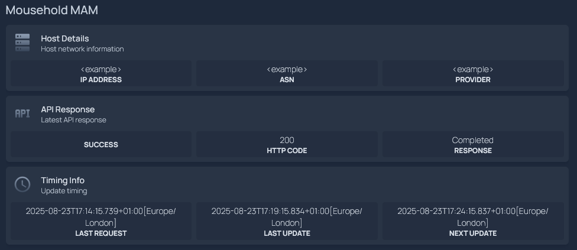

# Mousehole Homepage Integration

Configuration for integrating Mousehole with [Homepage](https://gethomepage.dev), a modern self-hosted homepage for your services.

## Features

- Display host network information (IP, ASN, Provider)
- Show latest MAM API response status
- Monitor update timing information
- Fully integrated widgets using Homepage's customapi service type

## Usage

1. Copy the contents of [`services.yaml`](./services.yaml) to your Homepage configuration
2. Replace `<mousehole-url>` placeholders with your actual Mousehole instance URL
3. Restart Homepage to load the new configuration

Example configuration structure:
```yaml
services:
  - Mousehole MAM:
    - Host Details:
        icon: mdi-server
        href: http://<mousehole-url>  # for example http://mousehole:5010
        description: Host network information
        widget:
          type: customapi
          url: http://<mousehole-url>/state  # for example http://mousehole:5010/state
          # ... rest of configuration
```




## Widget Types

### Host Details
Displays current network information:
- IP Address
- ASN
- Provider

### API Response
Shows the latest MAM API response:
- Success status
- HTTP response code
- Response message

### Timing Info
Monitors update timing:
- Last request time
- Last update time
- Next scheduled update time

## API Endpoints

The following API endpoints are available and could be called by Homepage:

### `/state`
- Primary endpoint used by Homepage widgets to display host information, API responses, and timing data

### `/ok`
- Simple status check endpoint
- **Note**: See [Known Limitations](#simple-status-endpoint-ok) regarding Homepage integration - currently not usable with Homepage

## Known Limitations

### Unsupported Endpoints

#### Simple Status Endpoint (`/ok`)
The `/ok` endpoint cannot be integrated with Homepage due to technical limitations:

- **HTTP Error Status Codes**: The endpoint returns HTTP 400 status codes even when providing valid JSON response data (`{"ok":false,"reason":"error-message"}`)
- **Homepage Restriction**: Homepage's `customapi` widget cannot process JSON responses from endpoints that return HTTP 4xx/5xx status codes, regardless of configuration options like `acceptErrors: true`
- **Note**: An issue has been raised to address this limitation: [mousehole#12](https://github.com/t-mart/mousehole/issues/12)

This affects the ability to monitor real-time service status and error conditions through the Homepage dashboard.

**Example configuration** (works only when API returns HTTP 200):
```yaml
- Simple Status:
    icon: mdi-api
    href: http://<mousehole-url>/ok
    description: Simple Status
    widget:
      type: customapi
      url: http://<mousehole-url>/ok
      method: GET
      mappings:
        - field: ok
          label: Status - OK?
          format: text
          suffix: " "
        - field: reason
          label: Reason
          format: text
```


### Other Technical Limitations

- **Boolean Display**: Boolean values in API responses require a `suffix` parameter to display properly in Homepage widgets (affecting use of `/ok` endpoint)
- **Datetime Formatting**: Temporal.ZonedDateTime format (containing timezone identifiers like `[Europe/London]`) displays as raw text rather than formatted dates. See discussion in [mousehole#10](https://github.com/t-mart/mousehole/issues/10#issuecomment-3172929431)

## Links

- [Homepage Documentation](https://gethomepage.dev)
- [Mousehole Repository](https://github.com/t-mart/mousehole)